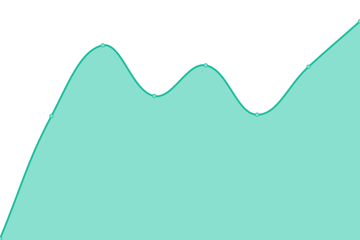
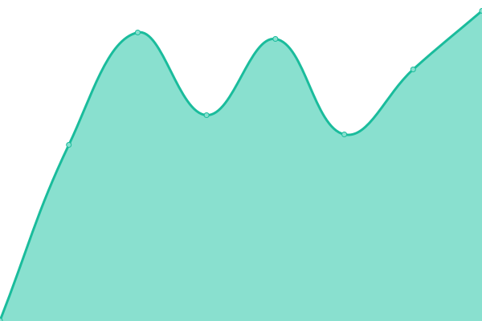

# [📈 Live Status](https://EdenMine.github.io/uptime): <!--live status--> **🟧 Partial outage**

This repository contains the open-source uptime monitor and status page for [EdenMine](https://www.edenmine.eu), powered by [Upptime](https://github.com/upptime/upptime).

With [Upptime](https://upptime.js.org), you can get your own unlimited and free uptime monitor and status page, powered entirely by a GitHub repository. We use [Issues](https://github.com/EdenMine/upptime/issues) as incident reports, [Actions](https://github.com/EdenMine/upptime/actions) as uptime monitors, and [Pages](https://EdenMine.github.io/upptime) for the status page.

<!--start: status pages-->
<!-- This summary is generated by Upptime (https://github.com/upptime/upptime) -->
<!-- Do not edit this manually, your changes will be overwritten -->
<!-- prettier-ignore -->
| URL | Status | History | Response Time | Uptime |
| --- | ------ | ------- | ------------- | ------ |
|  Main Dedicated Server | 🟩 Up | [main-dedicated-server.yml](https://github.com/EdenMine/uptime/commits/HEAD/history/main-dedicated-server.yml) | 

 105ms
     
 | 

<a href="https://uptime.edenmine.eu/history/main-dedicated-server">100.00%</a>
    

|  Web Server | 🟥 Down | [web-server.yml](https://github.com/EdenMine/uptime/commits/HEAD/history/web-server.yml) | 

 0ms
     
 | 

<a href="https://uptime.edenmine.eu/history/web-server">0.00%</a>
    

|  Internal API | 🟩 Up | [internal-api.yml](https://github.com/EdenMine/uptime/commits/HEAD/history/internal-api.yml) | 

 505ms
     
 | 

<a href="https://uptime.edenmine.eu/history/internal-api">100.00%</a>
    

<!--end: status pages-->

[**Visit our status website →**](https://EdenMine.github.io/uptime)

## 📄 License

- Powered by: [Upptime](https://github.com/upptime/upptime)
- Code: [MIT](./LICENSE) © [Anand Chowdhary](https://anandchowdhary.com), supported by [Pabio](https://pabio.com)
- Data in the `./history` directory: [Open Database License](https://opendatacommons.org/licenses/odbl/1-0/)
